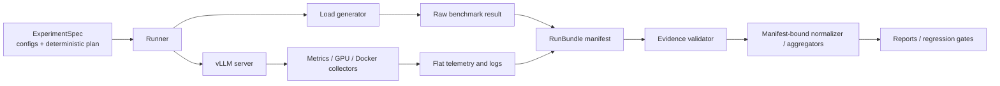

# LLM Serving Performance & RCA Lab

面向单机单卡 vLLM Serving 的可复现实验、性能归因与优化复验项目。重点不是
“把模型跑起来”，而是把一次性能结论变成可以审计的证据链：固定实验条件、保存
逐次运行证据、验证证据完整性、解释系统指标，并用同一 workload 做回归检查。

> 本项目运行在 Windows + WSL2 GPU-PV 上；所有数值只适用于下述硬件、模型和
> workload，不能外推为 bare-metal Linux 或其他模型的容量。

## 项目快照

当前 checkout 中已有报告记录了 **100 个 accepted run、72,580 个成功请求、0 个失败
请求**：

| 实验 | 正式 run | 请求 | 已验证结论 |
|---|---:|---:|---|
| Closed-loop baseline | 30 | 3,840 | c16 是 latency/throughput 候选 knee；c32 仍有吞吐收益，不能称为饱和点 |
| Prefill/Decode matrix | 20 | 1,280 | 长输入主要放大 TTFT/排队，长输出主要放大 E2E |
| Phase 3a finite boundary scan | 35 | 8,960 | 12–14 req/s 之间出现容量压力转折；14–16 req/s 出现 KV/cache-scheduler 压力证据 |
| Phase 3b long-window finite validation | 15 | 58,500 | 12/13/14 req/s completed with 200/4,000 ms SLO evidence; no tested rate passes the final sustainable-capacity gate |

数字来源分别见 [`baseline.md`](reports/baseline.md)、
[`prefill-decoder.md`](reports/prefill-decoder.md)、
[`open-loop.md`](reports/open-loop.md) 和
[`open-loop-steady.md`](reports/open-loop-steady.md)。Phase 3a 使用有限
256-request 批次；Phase 3b 使用 nominal 300-second arrivals。当前证据表明在
200/4,000 ms SLO 下，12 req/s 仍不是通过稳态门的 sustainable capacity。

这 100 个 accepted run 是当前正式证据总数，不等于“100 个 complete manifest”：
Phase 3b v1 的 15 个 run 是 accepted complete bundles，而早期报告中的历史
baseline/Prefill-Decode runs 仍可能是 legacy evidence。当前
normalizer、各 aggregate path、telemetry 与 SLO consumer 默认只接受并重新验证
complete manifest；重建尚未 backfill 的历史结果必须显式使用
`--allow-legacy-unmanifested`，per-run summary 会保留
`evidence_status=legacy-unmanifested`。

当前状态：Phase 0/1/2/3a 已完成，Phase 3b v1 已完成 long-window finite validation；
最终 steady-state capacity gate 仍未通过。下一轮建议测试 10/11/12 req/s。统一状态入口见
[`docs/progress.md`](docs/progress.md)。

## 这个项目展示什么

- **Benchmark design**：closed-loop、finite open-loop 与 steady-state 的问题边界
  分开定义；每次只改变一个主要变量。
- **Serving observability**：同时采集 vLLM queue/running/waiting、KV Cache、
  preemption、GPU telemetry、Docker stats 和 load-generator 明细。
- **Evidence engineering**：新 run 由 manifest 串联 flat raw/telemetry/log
  artifacts；拥有全部必需 sidecar 的历史 run 可在不重跑的情况下验证并 backfill
  manifest，缺证据的旧 run 会被明确拒绝；backfill 不会伪装成历史运行时
  provenance。
- **Performance RCA**：吞吐、TTFT/TPOT/E2E 与资源指标共同构成证据；GPU
  utilization 不被单独当作根因。
- **Scientific discipline**：跨重复报告 median/min-max；Phase 3b 使用 paired
  seed blocks 与落盘的确定性执行顺序，并把 SLO goodput、queue slope、P99 CI 和
  Little's Law 设为运行后的必过分析门。

## 系统与证据流



架构边界、RunBundle schema、状态机、artifact 分层策略和 correctness/performance
gate 见 [`docs/design.md`](docs/design.md)。完整实验路线见
[`docs/experiment-plan.md`](docs/experiment-plan.md)。

## 固定实验环境

- Host: Windows + WSL2 Ubuntu 22.04
- GPU: NVIDIA GeForce RTX 4060 8GB
- Serving: vLLM 0.26.0（固定 image digest）
- Model: `Qwen/Qwen3-0.6B`
- Model revision: `c1899de289a04d12100db370d81485cdf75e47ca`
- Max model length: 2048 tokens
- Baseline: synthetic fixed-length workload

服务设置与实验矩阵分别保存在 `configs/server.env` 和各 phase 配置中；正式
报告必须同时记录版本、参数和适用边界。

## 快速开始

启动并检查服务：

```bash
cd ~/projects/llm-serving-rca

./scripts/capture_env.sh
./scripts/start_server.sh
./scripts/health_check.sh
./scripts/run_smoke.sh
```

从当前已有 raw evidence 重建 baseline 分析（不运行 GPU benchmark）：

```bash
python3 benchmark/summarize_results.py \
  --pattern 'baseline-*.json' \
  --output baseline-summary.csv \
  --allow-legacy-unmanifested
python3 benchmark/aggregate_baseline.py \
  --allow-legacy-unmanifested
python3 benchmark/summarize_gpu_telemetry.py
./scripts/setup_analysis_env.sh
./.venv/bin/python benchmark/plot_baseline.py
```

不要在当前 evidence tree 上直接运行 `scripts/run_baseline.sh`：早期 Phase 1 raw 缺少
schema-v1 必需的 metrics JSONL，transactional runner 会 fail closed，而不是覆盖或
跳过它们。新的 baseline 需要先实现新的 run namespace/ID 或归档策略。

从已有 evidence 重建 Prefill/Decode 分析：

```bash
python3 benchmark/summarize_results.py \
  --pattern 'pd-*.json' \
  --output prefill-decoder-summary.csv \
  --no-gains \
  --allow-legacy-unmanifested
python3 benchmark/aggregate_prefill_decoder.py \
  --allow-legacy-unmanifested
./.venv/bin/python benchmark/plot_prefill_decoder.py
```

从已有 Phase 3a evidence 重建 open-loop tables：

```bash
python3 benchmark/summarize_results.py \
  --pattern 'open_loop-*.json' \
  --output open-loop-summary.csv \
  --no-gains \
  --allow-legacy-unmanifested
python3 benchmark/aggregate_open_loop.py \
  --allow-legacy-unmanifested
python3 benchmark/aggregate_telemetry.py \
  --pattern 'open_loop-*-metrics.jsonl' \
  --output results/summary/open-loop-telemetry-summary.csv \
  --allow-legacy-unmanifested
./.venv/bin/python benchmark/plot_open_loop.py
```

上面的分步命令适合学习每个 CSV 如何产生。熟悉流程后，可以用统一入口执行同样的
离线 pipeline：

```bash
# 历史、没有 schema-v1 manifest 的 evidence
python3 benchmark/analyze_phase.py phase1 --legacy
python3 benchmark/analyze_phase.py phase2 --legacy
python3 benchmark/analyze_phase.py phase3a --legacy --plot

# 新 run 已有 complete manifest 时，去掉 --legacy
python3 benchmark/analyze_phase.py phase3a --plot
```

入口只负责串联既有模块，不替代它们。每一步仍会打印实际执行的 Python 命令，并把
中间 CSV 保存在 `results/summary/`，便于停下来检查。阶段映射和输入/输出约定见
[`docs/reading-guide.md`](docs/reading-guide.md) 与
[`benchmark/phase_pipeline.py`](benchmark/phase_pipeline.py)。

Phase 3b v1 的配置和 runner 分别是
`configs/open_loop_steady.env` 与 `scripts/run_open_loop_steady.sh`。当前固定
12/13/14 req/s、`MAX_CONCURRENCY=1024`，并以 `rate * 300` 计算 prompt 数；300 秒
只是 nominal expected horizon，不是严格 wall-clock 截止。TTFT/E2E SLO 已冻结为
200/4000 ms，并写入 plan、manifest 和 raw metadata；runner 再把 namespace/attempt、plan
row/path/hash 与 SLO 写入 manifest/raw metadata，并由 validator 重新绑定校验。runner
的 planned permutation blocks 同时平衡位置和有向前序暴露；它还会核验并记录实际
container image、命令参数、served model 和 vLLM version。plan 本身不证明 retry 后
的实际 predecessor，仍需 accepted-attempt/execution ledger。

Phase 3b v1 已完成 evidence-producing run，但尚未完成的结论门是：严格 fixed-wall-clock loadgen 与 schedule-lag/client
cap-reach 证明、按 arrival window 对齐的 queue slope/end backlog 与 counter delta、
跨重复 P99 CI 和同窗口 Little's Law。正式批量执行前还需补 accepted-attempt 映射，
以及实际 execution ledger，让 immutable failed run 的 retry/resume 能被分析层无
歧义选中并保留真实 predecessor。它们完成前仍只能称 long-window finite
validation，不能发布长期 sustainable rate。详细结果见
[`reports/open-loop-steady.md`](reports/open-loop-steady.md)。

不使用 GPU 的 evidence/analysis 回归检查：

```bash
python3 -m unittest discover -s tests -v
python3 -m compileall -q benchmark tests
find scripts -type f -name '*.sh' -print0 | xargs -0 -n1 bash -n
```

停止服务：

```bash
./scripts/stop_server.sh
```

## 证据与发布策略

仓库默认忽略大型 raw、telemetry、日志和生成图表，避免日常 benchmark 污染
代码提交。公开 checkpoint 分三层：

1. Git 保存设计、配置、schema、报告、canonical aggregate CSV、关键图、run
   index/manifest 和校验和；
2. GitHub Release、DVC 或对象存储保存完整 raw/telemetry/log bundle；
3. 本机临时文件、PID、cache 和探索性输出不发布。

发布 evidence 前，per-run validator 检查 completed/failed、sidecar、collector
status、polling error 和 checksum；normalizer 默认查找并重新验证对应 complete
manifest，open-loop aggregator 再次绑定 manifest 并检查 run/repetition、paired
seeds、provenance 同质性和 schema 一致性。normalizer 还生成稳定的
`experiment_spec_sha256`，aggregators 按该 identity 分组，避免混合不同代码、server、
workload、plan 或 SLO。telemetry 与 SLO consumers 同样默认绑定并重验 complete
manifest，所有这些输出都传播 `evidence_status`。legacy bypass 必须显式开启，只能
用于有标签的历史重建，不能用于新实验正式验收。忽略目录中的新 evidence 只有在
复核后才能用 `git add -f` 明确加入；不得手工修改 raw artifact。

## 求职定位

本项目当前最能支撑 **LLM Inference Performance、Model Performance Tooling、
ML Systems Benchmarking、Serving Observability** 方向。它不宣称已经覆盖多 GPU
runtime、NCCL、Tensor Parallel、集群调度或 CUDA/Triton kernel 开发；这些方向
需要独立证据，而不是在 README 中扩展关键词。

下一项最有价值的交付是完成一条“过载现象 → queue/KV/preemption 证据 → 单变量
scheduler/cache 改动 → 同 workload 复验 → correctness 与其他 workload 回归”的
性能 RCA 闭环。

## License

MIT，见 [`LICENSE`](LICENSE)。
