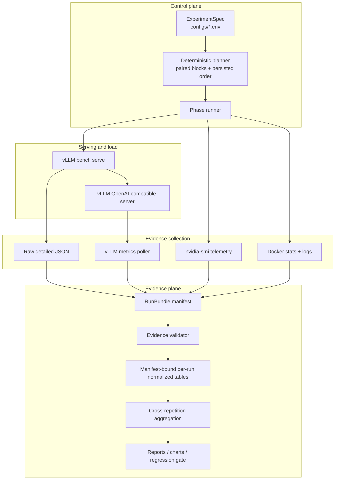
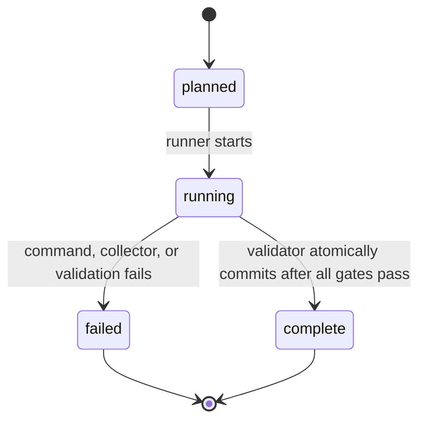
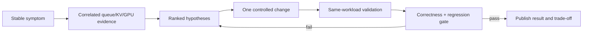

# LLM Serving Performance & RCA Lab：系统设计

## 1. 设计目标

本项目把 benchmark 设计成一个小型、可审计的实验系统，而不是一组只能在作者
机器上运行的 shell 命令。核心目标是：

1. **可复现**：一次运行的 workload、环境、版本、顺序和随机种子可追溯；
2. **可审计**：报告中的数字能回到完整且未被覆盖的 raw/telemetry/log evidence；
3. **可比较**：只有通过 correctness gate、实验条件一致的 run 才进入聚合；
4. **可归因**：client latency、server queue/KV/preemption 和 host/GPU 指标使用
   同一测量窗口解释；
5. **可回归**：优化必须报告收益、代价和其他 workload 的退化。

非目标：当前系统不模拟多节点生产集群，不声称 WSL2 数值可代表 bare-metal，
也不以单次峰值或 `request-rate=inf` 估算长期服务容量。

## 2. 总体架构



主要实现边界：

| 层 | 实现入口 | 职责 |
|---|---|---|
| ExperimentSpec | `configs/*.env` | 冻结 workload、repetition、arrival rate、seed 和 phase 条件 |
| Planner | `benchmark/plan_open_loop.py`、`results/plans/${RUN_NAMESPACE}-open-loop-steady-plan.tsv` | 为 Phase 3b 生成并 fail-closed 保存 paired-block、确定性执行计划 |
| Runner | `scripts/run_*`、`scripts/run_one_bench.sh` | 启动一次 run、协调 collectors、拒绝覆盖已有证据 |
| Collectors | `benchmark/poll_vllm_metrics.py`、`nvidia-smi`、Docker | 保存 server、GPU、container 的时间序列和前后快照 |
| RunBundle | `benchmark/evidence_manifest.py`、`results/manifests/` | 用 manifest 连接仍按 flat path 保存的历史与新 artifacts |
| Validator | `benchmark/validate_evidence.py` | 为 runner/resume 验证 bundle；normalizer 默认重验 complete manifest，open-loop aggregator 再次重验 |
| Analyzer | `benchmark/summarize_results.py`、`benchmark/aggregate_*.py` | 生成 per-run 和跨 repetition 的 canonical tables |
| Telemetry analyzer | `benchmark/aggregate_telemetry.py` | 重验 manifest，生成含 evidence status 的 queue/KV/preemption/counter-reset per-run table |
| SLO/correctness/regression | `benchmark/analyze_slo.py`、`benchmark/check_correctness.py`、`benchmark/check_regression.py` | SLO consumer 重验 manifest 并传播 status；提供确定性输出一致性和显式性能预算 |
| Offline CI | `.github/workflows/offline-evidence-ci.yml`、`tests/` | 无 GPU 测试 planner、analysis、telemetry 与 evidence invariants |
| Delivery | `reports/`、`charts/`、`docs/progress.md` | 只发布通过 gate 的结论并声明适用边界 |

为了兼容已经存在的 evidence，RunBundle **不搬迁** flat 文件。manifest 只保存
`results/raw/`、`results/telemetry/`、`artifacts/logs/` 中 artifact 的相对路径、
大小和 SHA-256；拥有八项 required artifacts 的 Phase 2/3 run 可以验证后回填
`provenance_capture=backfilled`，无需重跑。早期 Phase 1 没有 metrics JSONL，不能
通过当前 schema v1；系统必须保留并明确标为 legacy evidence，不能伪造 sidecar 或
把它自动升级为 complete manifest。

backfill 只能证明“当前文件 bundle 完整”，不能倒推历史运行环境。v1 因此写入
`provenance.represents_run_time=false`，并把 Git/server capture scope 标为
`manifest_backfill_time`；报告不得把 backfill 时的 checkout/config 冒充为 run-time
provenance。

## 3. ExperimentSpec 与执行计划

ExperimentSpec 必须在运行前固定以下条件：

- identity：phase、case、run ID、repetition/block；
- workload：model/revision、input/output length、prompt source、temperature、EOS
  行为；
- load：arrival model、request rate、arrival window 或 prompt count、max
  concurrency、load-generator seed；
- server：image digest、完整启动参数、prefix cache、chunked prefill、KV/scheduler
  参数；
- environment：Git SHA、dirty-status hash、host/GPU/container snapshot；
- execution：planned order、plan shuffle seed、warmup、正式测量窗口和 cooldown；
  三档 Phase 3b 使用 permutation blocks，使位置和有向 predecessor 暴露的计数差
  都不超过 1；

Phase 3b 使用 **paired seed blocks**：一个 repetition/block 内，12/13/14 req/s
共用同一个 load-generator seed，从而比较相同随机轨迹；rate 顺序由固定
`PLAN_SHUFFLE_SEED` 确定并写入 plan。计划文件是 planned order 的权威记录，不是
实际执行 ledger；它只能证明设计中的 position/predecessor exposure，不能单独证明
运行时顺序或 carryover。

当前 planner 会把 namespace、rate、seed、repetition/block/order、nominal horizon、
SLO 与 workload 条件写入 plan；runner 再把 namespace/attempt、plan row/path/hash 和
SLO 写入 manifest/raw metadata。validator 校验 plan SHA-256、要求恰好匹配一行，并
核对 raw metadata。TTFT/E2E SLO 在 checked-in config 中故意留空；runner 会拒绝
执行，直到用户在首个正式 run 前冻结正有限阈值。

## 4. RunBundle 与状态机

一个 RunBundle 的逻辑内容为：

```text
results/manifests/<run-id>.json
  -> results/raw/<run-id>.json
  -> results/telemetry/<run-id>-metrics.jsonl
  -> results/telemetry/<run-id>-gpu.csv
  -> results/telemetry/<run-id>-metrics-before.txt
  -> results/telemetry/<run-id>-metrics-after.txt
  -> results/telemetry/<run-id>-docker-before.txt
  -> results/telemetry/<run-id>-docker-after.txt
  -> artifacts/logs/<run-id>.log
```

当前 schema v1 已实现：

- schema version、run ID、phase、`planned/running/complete/failed` 状态、独立的
  `validation.status=pending/passed/failed/not_run` 和时间戳；其中 `not_run` 表示在
  validation 之前已有 runtime/collector failure；
- workload 与关键 server settings 的冻结副本；
- Git SHA、dirty flag/status hash、image digest 和 model revision；新 run 还记录实际
  container image ref/ID、command JSON 与 vLLM version response；
- Phase 3b 的 immutable namespace/attempt、paired block/order、nominal horizon、
  SLO、plan path 和 SHA-256；
- 每个 artifact 的相对路径、字节数、SHA-256；benchmark/GPU/metrics exit code；
- validation result 和 failure reason；completed/failed 保留在 raw JSON 中并由
  validator 检查，避免在 manifest 复制另一份可能漂移的计数；
- `provenance_capture=run_start/backfilled`，区分新 run 与历史证据回填。

新 run 启动前，runner 会 `docker inspect` 实际 image ref/ID 和 command，逐项核对
model/revision、port、max model length、GPU memory utilization、server seed、prefix
cache 与 chunked prefill，并通过 `/v1/models` 和 `/version` 核对 served model、记录
vLLM version；不匹配时 fail closed。这使 manifest 的 actual container settings 成为
run-start observation，而不只是 config expectation。backfill 的旧 bundle 仍只能保留
`manifest_backfill_time` scope，不能获得历史 runtime attestation。

后续 schema version 仍需补充 load-generator tool version，以及 warmup、arrival、
steady measurement、drain 的 UTC/monotonic 窗口边界。缺少这些字段时，可以验证
artifact endpoint/span 和绑定关系，但不能声称 client/server 时间窗口已经完全对齐。

状态机：



validation 是独立字段而不是第五个持久化 run 状态。runner 不能自行把 run 标成
`complete`；只有 validator 在全部检查通过后才能原子提交
`running -> complete`。runner resume、`summarize_results.py` 和
`aggregate_open_loop.py` 默认都要求 complete manifest 并重新验证 bundle。历史 raw
只有在显式 `--allow-legacy-unmanifested` 时才能进入重建，并会标为
`evidence_status=legacy-unmanifested`；该 bypass 不能用于新实验验收。失败/部分写入
的 artifact 保留用于 RCA，但不能被伪装成正式样本，也不能被自动覆盖；诊断后重跑
会创建另一个 run ID 和新的 `planned` manifest，不在 terminal manifest 上回退状态。

## 5. Evidence validator

validator 已是 transactional runner/resume 与默认 analyzer path 的硬边界。当前
per-run validator 已检查：

1. manifest schema 与八个预期 artifact names；raw 只能位于 `results/raw/`，
   benchmark log 只能位于 `artifacts/logs/`，其余 sidecar 只能位于
   `results/telemetry/`；
2. raw、benchmark log、GPU CSV、metrics JSONL、metrics before/after、Docker
   before/after 全部存在且非空；complete manifest 重验时 size/SHA-256 必须匹配；
3. raw JSON 的 run ID、phase、workload、rate、seed、repetition 与 runner 传入的
   expected spec/manifest 一致；
4. `completed == expected`、`failed == 0`，per-request 数组长度与 completed 一致；
5. metrics JSONL 至少两个 samples、相邻 sample gap 不超过 5 秒、关键指标族齐全且
   poller 无 error；GPU 与其他 sidecar 非空；
   新 run 的 benchmark/GPU/metrics exit status 都被记录且 acceptable；
6. metrics monotonic endpoints 在 2 秒容差内包住 first arrival 到 derived last
   completion；GPU CSV 时间戳严格递增，整体 span 至少达到 raw benchmark duration；
7. Phase 3b 的 SLO 必须正且有限，plan path/hash 必须有效，manifest/raw 必须恰好
   绑定 plan 中的一行。

这些是 endpoint/span gates，不是完整的 per-window coverage attestation：metrics 有
5 秒的粗粒度 max-gap gate，但 GPU 仍只有整体 span，没有 max-gap 或逐端点对齐
arrival/completion。严格 steady-state 验收仍需明确 arrival window，并在同一窗口内
计算 queue slope/end backlog 与 counter delta。

open-loop aggregation/telemetry 层另外检查 cumulative counter reset、重复/缺失
repetition、跨 rate paired seed blocks，以及缺失或部分可选列，并在错误时 fail
closed。孤立 manifest/artifact 和所有 phase 的统一 evidence index 仍应作为发布前
全局 audit gate，不能由单个 run validator 代替。

`aggregate_open_loop.py` 要求同一 group 的 provenance 同质并把 evidence status
传播到 aggregate CSV；`aggregate_telemetry.py` 与 `analyze_slo.py` 也默认查找并重验
complete manifest，在输出中保留 status。三者只在显式
`--allow-legacy-unmanifested` 时接收历史无 manifest 数据。统一的跨 phase evidence
index 仍有价值，但 consumer fail-closed gate 已经实现。normalizer 从固定 Git、
server、workload config、plan/SLO 生成 `experiment_spec_sha256`；baseline、
Prefill/Decode 与 open-loop aggregators 按该 identity 分组并传播它，防止不同
ExperimentSpec 被静默混入同一个 median。

offline CI 不依赖 GPU，当前运行 unit tests、Python compile 和 shell syntax；fixtures
覆盖 manifest transition/backfill/tamper detection、metrics/GPU coverage、polling
error、planner paired seeds/determinism、raw array 完整性、重复 repetition/seed、
request-level SLO/correctness/regression 与 telemetry counter reset/fail-closed。跨 bundle 缺
repetition、从 fixtures 重建 canonical CSV 的 golden diff 和 `shellcheck` 是下一步
需要补齐的 CI gates。

## 6. Phase 3 容量方法

### 6.1 Phase 3a：finite boundary scan（已完成）

Phase 3a 在 4/6/8/10/12/14/16 req/s 使用 256 个请求、每档 5 次，目的只是把
容量压力的转折区间缩小。已有证据把 practical knee 定位在 12–14 req/s：rate 14
开始出现 near-full KV、capacity waiting 和 preemption，rate 16 是明确过载条件。

`completed throughput / configured request rate` 是有限批次诊断值。benchmark
duration 包含到达结束后的请求完成时间，所以这个比值不是完成率，低于 100% 也不
表示请求丢失；所有 8,960 个请求均成功。有限批次还能在到达结束后 drain，因此
Phase 3a 不能证明 12 req/s 能长期稳定运行。

### 6.2 Phase 3b：long-window validation toward steady state（待运行）

Phase 3b 固定 512/128 workload 和现有 server 参数，只验证边界附近 12/13/14
req/s：

- nominal arrival horizon：每次按 `num_prompts = rate * 300 seconds` 规划；记录 raw
  `start_times` 得到 realized arrival span；warmup 与正式请求分离；
- `MAX_CONCURRENCY=1024`，让 client semaphore 高于 Phase 3a 推算的最坏 backlog；
  是否实际触及 cap 仍必须由 schedule-lag/cap-reach 指标证明；
- 每个 rate 五个 paired seed blocks；执行顺序由 seed-derived plan 确定并落盘；
- 有限 arrival sequence 发送完后继续记录直到所有请求完成；
- 单独记录 scheduled、realized sent、benchmark-wide completed 和 approximate drain；
  在有明确窗口标记后再区分 steady-window/post-window completions；
- 对 queue depth 计算时间窗口斜率，并记录窗口末 backlog，不能只看最大值；
- 对 P99 TTFT/E2E 报告跨 repetition 分布和 bootstrap confidence interval；
- 在运行前声明 TTFT/E2E SLO，以 goodput 作为服务容量指标之一。

当前 runner 通过 prompt count 近似 300 秒，而不是按 wall clock 在 300 秒精确停止
到达；因此它是 long-window finite test。真正的 fixed-window experiment 仍需
time-bounded load generator 和 window timestamps。

当前 `aggregate_telemetry.py` 已提供 queue maxima、KV P95/max、poll error 和
counter-reset 检查；preemption/queue-time delta 优先使用 metrics before/after 快照，
这是已实现的 **benchmark-envelope before/after delta**，窗口包含 warmup、正式请求
与 drain，不等于 arrival-window delta。`summarize_results.py` 已提供 arrival span、
realized send rate 与 approximate drain。manifest/validator 已绑定 SLO 与 plan
identity，runner 已实现 actual container attestation。正式 Phase 3b 还缺以下结论门：

1. 严格 fixed-wall-clock loadgen，以及 schedule lag 和 client cap reach；
2. 与 arrival window 对齐的 queue slope、end backlog 和 completion 切分；
3. 使用 arrival-window 边界 snapshots 的 cumulative counter delta；
4. 跨 repetition 的 P99 bootstrap CI 与同窗口 Little's Law；
5. logical cell 到 accepted attempt 的映射和 actual execution ledger。

immutable failed manifest 虽可用新 attempt 单 cell 重试，但该 retry 可能在不同时间、
不同实际 predecessor 下执行。没有 accepted-attempt/execution ledger 时，plan 只能
证明 planned predecessor，分析层也仍需人工筛选 failed/complete attempt。

现有 queue maximum 和 benchmark-envelope before/after delta 不能替代这些稳态指标。

Phase 3b 的容量判定必须同时满足：

1. 实际发送速率接近计划速率，client concurrency cap 未截断流量；
2. steady-window completed rate 能跟上 actual sent rate；
3. queue/backlog 没有持续正斜率，drain time 不随运行时间无界增长；
4. P99 TTFT/E2E 在重复间稳定并满足预先声明的 SLO；
5. 无失败、timeout、preemption、collector error 或 correctness violation；
6. Little's Law 数量级检查与同一稳态窗口的数据相容。

在这些条件完成前，报告只能说“finite-scan candidate”或“transition band”，不能
使用“long-term sustainable capacity”。

## 7. SLO、goodput 与 Little's Law

SLO 必须在运行前随 ExperimentSpec/manifest 保存，不在看完曲线后选择。当前
`open_loop_steady.env` 故意把 TTFT/E2E SLO 留空；runner 在它们为空时 fail closed。
一旦选定，planner 会把阈值写入持久化 plan，runner 写入 manifest/raw，validator
再校验阈值为正有限值、plan hash 与唯一 plan row；`analyze_slo.py` 还拒绝与 frozen
manifest 不一致的 CLI threshold。每个请求只有同时满足正确性、TTFT SLO 和 E2E
SLO 才计入：

```text
steady_goodput = count(success AND correctness AND TTFT<=SLO_ttft AND E2E<=SLO_e2e)
          / steady_measurement_window_seconds
```

同时保留 request throughput 和 output token throughput，避免 goodput 掩盖实际
资源消耗。SLO 不同会得到不同 operating point；没有预先声明 SLO 时，不给出
“production capacity”。

当前 `benchmark/analyze_slo.py` 从 detailed arrays 计算
`benchmark_goodput_req_s`，分母是完整 benchmark duration；它还报告 realized send
rate 和 arrival span。这个指标可以复用 request-level SLO 判定，但在加入明确的
steady-window completion timestamps 前，不能改名为 `steady_goodput`。

Little's Law 只使用对齐的 steady window：

```text
L_observed = mean(running_requests + waiting_requests)
L_estimated = lambda_completed * mean(E2E_seconds)
```

比较两者的数量级与相对误差，并记录采样频率、window clipping 和 client/server
时钟边界。它是数据一致性检查，不替代 queue slope、tail SLO 和失败检查。

## 8. Correctness 与 regression gate

每个性能 A/B 必须先通过 correctness gate：

- HTTP/stream 解析成功，无 benchmark error、timeout 或空响应；
- completed/failed 与计划相符，实际 input/output token 数满足 workload 约束；
- 对确定性 paired run，`benchmark/check_correctness.py` 逐项比较 input/output token
  length 与 generated text；公开 Tier-1 index 可另存 hash，完整文本留在 Tier-2 raw；
- server 与 collectors 无 crash，counter reset 和采样缺口被显式报告；
- temperature、EOS、model revision、tokenizer 和非目标参数完全一致。

`check_correctness.py` 与 `check_regression.py` 是 pair/table-level gates，本身不解析
RunBundle；调用方必须只传入已经由 manifest-bound consumers 验证过的 raw/aggregate
路径，不能用它们绕过 evidence admission。

性能 gate 使用预先登记的阈值，至少同时报告：

- median 与 P99 TTFT/E2E/TPOT、request/output throughput、SLO goodput；
- queue slope、end backlog、KV usage、preemption、GPU/host 代价；
- baseline workload、压力 workload 和一个非目标 workload 的回归；
- point estimate、重复间 min-max/CI，以及实际样本数。

优化结果必须写成 `change -> expected signature -> observed evidence -> benefit ->
cost -> regression`。如果只改善短请求但伤害长请求或总吞吐，必须把副作用放在与
收益同一级，而不是隐藏在限制章节。

## 9. Artifact 分层与发布

| 层 | 内容 | 保存位置 | 发布规则 |
|---|---|---|---|
| Tier 1：reviewable | configs、schema、`results/plans/`、manifest/index、canonical CSV、报告、关键图、checksums | Git | 每个 checkpoint 必须具备；小而可审查 |
| Tier 2：full evidence | raw detailed JSON、完整 telemetry、Docker/server/loadgen logs | Release/DVC/object storage | 用 checksum 与 Tier 1 互相验证 |
| Tier 3：ephemeral | PID、cache、临时计划、exploratory output | local only | 可重建，不进入发布包 |

公开前检查 hostname、用户名、本机绝对路径、token/cache 路径和可能的 secret；保留
可复现所需的版本与相对路径，用结构化 redaction 记录替换动作。没有完整 Tier 2
时，报告必须明确哪些原始证据仅存在于本地。

## 10. RCA 与交付阶段门



下一条核心交付应复用 Phase 3a 的 14–16 req/s 压力签名，隔离一个 scheduler/KV
变量并完成上述闭环。只有 Phase 3b 验证、至少一个性能 RCA 修复、无 GPU CI 和
可下载 evidence index 都通过，项目才进入最终 portfolio checkpoint。

## 11. 求职能力边界

当前设计直接展示 inference performance、benchmark tooling、serving
observability 和 evidence-based RCA。面试时应从实验问题、控制变量、指标签名、
证据限制与下一次验证讲起，而不是只背最终数字。

多 GPU runtime、NCCL/Tensor Parallel、Kubernetes production operations 和
CUDA/Triton kernel optimization 不在当前证据边界内。若目标岗位要求这些能力，
应增加独立、可验证的项目或实验，不把本项目的单卡结论包装成相关经验。
