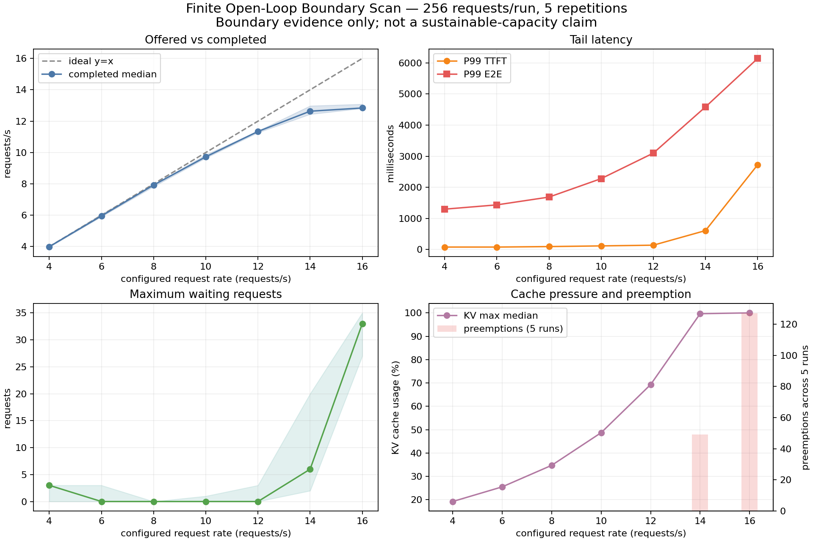

# Phase 3a: vLLM Finite Open-Loop Boundary Scan

## 1. Purpose

Measure how a finite Poisson arrival rate changes completed request
throughput, tail latency and serving pressure for the Phase-1 workload. The
purpose of Phase 3a is to locate the transition band that a longer steady-state
test must validate. It does **not** establish long-duration sustainable
capacity.

This report is specific to the WSL2/GPU-PV environment and workload recorded
in this checkout. It is not a capacity claim for bare-metal Linux, another
GPU, model or request mix.

## 2. Environment and method

- Run date: 2026-08-10 UTC
- GPU: NVIDIA GeForce RTX 4060 8GB
- vLLM: 0.26.0
- Model: `Qwen/Qwen3-0.6B`, revision
  `c1899de289a04d12100db370d81485cdf75e47ca`
- Maximum model length: 2048 tokens
- GPU memory utilization: 0.65
- Prefix caching: disabled
- Chunked prefill: enabled
- Input/output length: 512/128 tokens
- Formal requests per run: 256
- Warmup requests per run: 8
- Maximum concurrency: 256
- Arrival process: finite request rate, Poisson burstiness factor 1.0
- Offered rates: 4, 6, 8, 10, 12, 14 and 16 requests/s
- Repetitions: 5 per rate

The benchmark captured detailed JSON results, per-request latency data,
one-second `nvidia-smi` telemetry, before/after snapshots, and 0.5-second
selected vLLM metrics streams. The aggregate uses the median across five
repetitions; its source is [`open-loop-aggregate.csv`](../results/summary/open-loop-aggregate.csv).

## 3. Executive result

This finite scan narrows the transition to **12–14 offered requests/s**. At
12 requests/s, all five finite batches completed without preemption, observed
maximum waiting was 0–3 requests, and maximum KV-cache usage was 68.0–86.2%.
The median benchmark-wide completed throughput was 11.46 requests/s.

The transition begins at **14 requests/s**: the benchmark-wide
throughput/configured-rate ratio is 90.3%, four of five repetitions show
preemptions, KV-cache usage reaches 99.1–100.0%, and capacity waiting reaches
2–18 requests. All requests still complete; the ratio reflects the longer
end-to-end batch duration, not a 9.7% request loss.

At **16 requests/s**, the service is clearly overloaded. Increasing the offered
rate from 14 to 16 requests/s raises median output throughput by only 1.3%,
while median P99 TTFT rises by 703.3%. All five repetitions show preemptions,
28–42 waiting requests and 99.9–100.0% KV-cache usage.

Therefore, Phase 3a supports three bounded statements: 12 requests/s is the
upper clean **finite-batch candidate**, 14 requests/s is the capacity-pressure
transition, and 16 requests/s is an overload condition. Whether 12 or 13
requests/s is sustainable under a declared SLO remains unverified and is the
purpose of Phase 3b.

## 4. Aggregate results

All values below are medians across five repetitions. The full min-max spread
for every metric is retained in the aggregate CSV.

| Configured req/s | Benchmark-wide completed req/s | Finite-batch ratio | Output tok/s | P50 TTFT ms | P99 TTFT ms | P99 TPOT ms | P99 E2E ms |
|---:|---:|---:|---:|---:|---:|---:|---:|
| 4  | 4.041 | 101.0% | 517.2  | 40.1  | 111.7  | 9.47 | 1,276.1 |
| 6  | 6.015 | 100.2% | 769.9  | 42.8  | 151.5  | 11.76 | 1,535.3 |
| 8  | 7.959 | 99.5%  | 1,018.8 | 47.7  | 154.6  | 14.24 | 1,872.1 |
| 10 | 9.889 | 98.9%  | 1,265.7 | 57.1  | 142.9  | 18.74 | 2,464.7 |
| 12 | 11.460 | 95.5% | 1,466.9 | 69.7  | 180.5  | 23.55 | 3,094.9 |
| 14 | 12.645 | 90.3% | 1,618.5 | 101.3 | 385.4  | 32.79 | 4,281.6 |
| 16 | 12.806 | 80.0% | 1,639.2 | 680.2 | 3,095.5 | 38.35 | 6,006.8 |

The ratio is `benchmark-wide completed throughput / configured request rate`.
It is not a request-success percentage: every run completed all 256 requests.
The configured Poisson process has finite-sample arrival variation, and the
benchmark duration includes completion/drain after the last arrivals. This is
why the ratio can exceed 100% at rate 4 and fall below 100% under queueing. A
steady-window sent/completed comparison is required in Phase 3b.

The rate curve has a clear plateau. From 12 to 14 requests/s, output
throughput increases 10.3%, but P99 TTFT increases 113.5%. From 14 to 16,
the offered load increases 14.3% while completed throughput increases only
1.3%; the extra arrivals create queue debt, cache pressure and longer drain
rather than proportional useful throughput.

P99 E2E latency rises at every rate, from 1.28 s at rate 4 to 6.01 s at rate
16. At rate 12 the median P99 E2E is 3.09 s; the repetition range is
3.05–3.62 s. At rate 14 it is 4.28 s with a 4.22–5.85 s range, and at rate 16
it is 6.01 s with a 6.00–6.88 s range.

## 5. Queue, KV-cache and preemption evidence

The table reports the maximum observed value in each 0.5-second metrics stream,
shown as the range across the five repetitions. Queue-time sum is the median
counter delta from the metrics before/after snapshots, with its min-max range.
That benchmark envelope includes warmup, formal requests and drain.

| Offered req/s | Max waiting requests | Max capacity-waiting | Max KV-cache usage | Runs with preemptions | Queue-time sum delta, seconds |
|---:|---:|---:|---:|---:|---:|
| 4  | 0–0  | 0–0  | 16.2–26.4% | 0/5 | 0.64 [0.50, 1.11] |
| 6  | 0–3  | 0–3  | 23.7–34.4% | 0/5 | 0.82 [0.60, 1.04] |
| 8  | 0–3  | 0–3  | 30.4–45.0% | 0/5 | 0.69 [0.06, 1.11] |
| 10 | 0–1  | 0–1  | 46.8–66.0% | 0/5 | 0.63 [0.58, 1.10] |
| 12 | 0–3  | 0–3  | 68.0–86.2% | 0/5 | 0.76 [0.52, 1.46] |
| 14 | 2–18 | 2–18 | 99.1–100.0% | 4/5 | 3.71 [2.27, 67.16] |
| 16 | 28–42 | 28–42 | 99.9–100.0% | 5/5 | 182.95 [163.45, 276.73] |

All observed waiting was attributed to `capacity`; deferred waiting remained
zero. The preemption deltas were 0–19 per run at rate 14 and 23–33 per run at
rate 16. These changes align with the latency and throughput break at the
same rates.

## 6. GPU evidence

Across all rates, one-second GPU samples reached 99–100% utilization and an
SM clock of 2,790 MHz. Maximum observed temperature was 64–69 C and maximum
reported memory use was approximately 7,733–7,758 MiB. There was no evidence
of a clock or thermal collapse at the overloaded rates.

High utilization is therefore not sufficient to identify the limiting factor:
the low-rate runs were also near 99% utilization. The combination of
capacity-specific waiting, near-100% KV-cache usage and preemptions at rates
14–16 is stronger evidence for scheduler/KV-cache capacity pressure than for
thermal throttling.

## 7. Interpretation

### Confirmed facts

- All 35 formal runs completed: 8,960/8,960 requests succeeded and 0 failed.
- The benchmark-wide throughput/configured-rate ratio is near 100% through
  rate 10, 95.5% at rate 12, and 90.3%/80.0% at rates 14/16. This ratio is a
  finite-batch diagnostic, not a success fraction or steady-window rate.
- Output throughput nearly saturates between rates 14 and 16: 1,618.5 to
  1,639.2 output tokens/s.
- Rate 14 introduces repeated capacity pressure; rate 16 shows it in every
  repetition.
- No metrics-polling errors were recorded in the 35 metrics streams, and no
  deferred waiting was observed.

### Evidence-based inferences

- The finite-scan practical knee for this workload is between 12 and 14
  requests/s. Rate 12 retains headroom in the observed finite batches and
  avoids preemption; rate 14 does not.
- The rate-16 plateau is not a useful throughput target. It is the result of
  pushing more arrivals into a service whose request throughput has already
  reached approximately 12.8 requests/s.
- The overload signature is consistent with KV-cache/scheduler capacity
  pressure: capacity waiting and KV usage rise together, then preemptions and
  queue-time accumulation appear. Stable clocks and temperatures make thermal
  throttling an unlikely explanation.

### Unverified hypotheses

- This experiment does not prove a long-duration sustainable rate. Each point
  is a finite 256-request batch lasting roughly 20–63 seconds, and the queue
  can drain after arrivals stop.
- The exact operating point for a production SLO is unknown because no TTFT or
  E2E target was specified. A strict latency SLO may require choosing 10
  requests/s or below despite the cleaner finite-batch behavior at rate 12.
- The metrics counter deltas span the benchmark envelope, including warmup
  and drain, and are diagnostic evidence rather than a formal steady-state
  queueing rate.

## 8. Recommendations

1. Use 12/13/14 requests/s as Phase 3b validation points for this exact
   workload; do not publish 12 requests/s as a long-term capacity number.
2. Validate each rate with five paired seed blocks over a nominal 300-second
   horizon. Persist the seed-derived planned rate order, record realized arrival span,
   schedule lag and client-cap reach, separate arrival and drain evidence, and
   record window-aligned queue slope/end backlog rather than only maxima. A
   strict fixed-window claim requires a time-bounded load generator.
3. For the next RCA phase, investigate KV-cache and scheduler behavior at
   rate 14–16. Keep the model, GPU-memory setting and chunked-prefill setting
   fixed while isolating one scheduler/cache variable at a time.
4. Declare TTFT/E2E SLOs before Phase 3b; report SLO goodput, actual sent and
   steady-window completed rate, arrival-window counter deltas, P99 confidence
   intervals and a same-window Little's Law consistency check. Existing
   before/after snapshots include warmup and drain and remain diagnostic only.

## 9. Evidence and limitations

- [`open-loop-aggregate.csv`](../results/summary/open-loop-aggregate.csv):
  median/min/max aggregation by offered rate
- [`open-loop-summary.csv`](../results/summary/open-loop-summary.csv): one row
  per run
- `results/raw/open_loop-*.json`: 35 detailed benchmark results
- `results/telemetry/open_loop-*-metrics.jsonl`: 35 vLLM metrics streams
- `results/telemetry/open_loop-*-gpu.csv`: 35 GPU telemetry streams
- `artifacts/logs/open_loop-*.log`: benchmark logs
- `benchmark/aggregate_telemetry.py`: fail-closed regeneration of the per-run
  queue/KV/preemption table (`results/summary/open-loop-telemetry-summary.csv`)

The workload uses one model, one GPU, fixed synthetic 512/128-token requests,
finite batches, 0.5-second metrics sampling and one-second GPU sampling. The
Phase 3a command does not pass an explicit load-generator seed and the raw JSON
does not record one, so distinct or paired Poisson traces cannot be audited
from this evidence. Phase 3b fixes seeds explicitly and preserves its execution
plan.

The benchmark logs contain known WSL pin-memory, Triton and AVX2
load-generator warnings; all formal requests still completed successfully.
